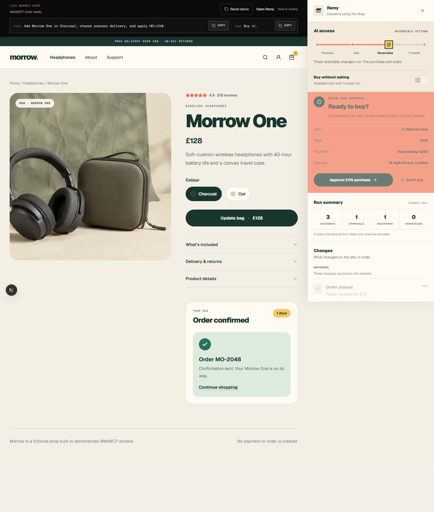

# Remy

**Control, receipts, and recovery for AI agent actions.**

Let reversible work happen automatically.

Pause what matters.

Give users a way back.

Remy is an open-source action layer for applications where AI agents change
real state. Developers define meaningful operations once; Remy applies policy,
records what happened, and exposes the correct approval or recovery path.

```text
4 changes
3 automatic
1 consequential approval
75% fewer interruptions in this demo
```

That comparison is specific to the Morrow journey: **Ask on changes** requires
four approvals, while **Reversible actions** runs three reversible changes and
pauses once before purchase.



> **Release status:** early WebMCP implementation. The source demo works today;
> Remy packages and a one-call installer are not published yet. See the
> [roadmap](./ROADMAP.md).

## Run locally

Requirements: Node.js 20 or newer and npm.

```bash
git clone https://github.com/MustafaK99/Remy.git
cd Remy
npm ci
npm run dev
```

Open:

- Product site: [http://localhost:3000](http://localhost:3000)
- Working demo: [http://localhost:3000/demo](http://localhost:3000/demo)
- Documentation: [http://localhost:3000/docs](http://localhost:3000/docs)

Every command above works from a clean checkout. Do not use
`npx @remy-ai/cli init`: the required public packages do not exist yet.

## Record the WebMCP demo

1. Open `/demo` in a browser that supports the imperative WebMCP API.
2. Open Remy and briefly select **Ask on changes**. The control explains that
   this journey would produce four approval interruptions.
3. Select **Reversible actions**.
4. Copy the first prompt from the page:

   ```text
   Add Morrow One in Charcoal, choose express delivery, and apply HELLO10.
   ```

5. The assistant calls `add_to_cart`, `choose_delivery`, and `apply_discount`.
   All three changes run automatically and receive receipts.
6. Open Remy and restore express delivery to standard. The total changes from
   £123 to £115 and a linked recovery receipt is appended.
7. Copy the second prompt:

   ```text
   Buy it.
   ```

8. Remy shows **Approve £115 purchase** using the current authoritative total.
9. Approve it and show order confirmation.
10. End on the local run summary: 4 changes, 3 automatic, 1 approval,
    1 recovered, 0 unresolved.

Use **Reset demo** at the top of the page before every recording. It clears the
shop, receipts, approvals, assistant identity, control requests, and local
persistence.

Browsers without WebMCP receive a clear compatibility message. The ordinary
shop and manual controls continue to work.

## What is working

- A protocol-neutral semantic action engine.
- Runtime-validated action input.
- Preview, execute, policy, approval, and recovery in one execution path.
- Preview, ask, reversible, and trusted autonomy modes.
- Explicit purchase permission separate from general autonomy.
- Human-readable diffs and append-only receipts.
- Exact reversal and compensation semantics.
- Stale-approval detection and resource-version-safe reversal.
- Idempotent actions and reversals.
- Local persistence without action replay.
- Imperative WebMCP registration with cleanup.
- Self-reported agent identity for attribution, never authorisation.
- Shared execution for website buttons and agent tools.

WebMCP is the first adapter, not the product boundary. MCP and agent framework
adapters remain roadmap work.

## Architecture

```text
WebMCP adapter / website UI
            |
            v
      RemyEngine.run()
       - validate input
       - build preview
       - decide policy
       - execute or pause
       - append events
       - expose recovery
            |
            +--> application state
            +--> observable receipts
```

Important directories:

- `src/remy/core` — engine, policy, types, run summary, and tests.
- `src/remy/adapters` — the current demo-coupled WebMCP adapter.
- `src/remy/react` — the demo provider and observable UI boundary.
- `src/demo` — Morrow state and semantic action definitions.
- `src/components/demo` — the fictional shop and example Action Center.

The core imports neither React nor WebMCP. The current WebMCP hook is coupled to
`DemoState`; making it generic is explicitly tracked in the roadmap.

## Action receipts and privacy

Remy records semantic state-changing actions and their control decisions, not
general browsing or conversations. The demo uses strict schemas with
`additionalProperties: false` and stores compact local receipts containing the
action, version, time, actor, self-reported assistant label, validated input,
policy outcome, result, readable diff, reversibility, recovery relationship,
resource versions, idempotency key, duration, and error code where applicable.

Do not put these values in a receipt by default:

- Full prompts or chat transcripts.
- Keystrokes, browsing history, DOM recordings, or session replay.
- Arbitrary application state.
- Secrets, credentials, full payment details, or large binary payloads.

Persistence must remain pluggable. The demo uses local storage only. Future
durable stores must support retention, redaction, and external references for
large payloads.

## Safety boundary

- The host application remains responsible for authentication, authorisation,
  eligibility, and authoritative prices or totals.
- Purchases ask by default. Unattended buying requires **Trusted run** plus a
  separate user-granted permission.
- An assistant cannot grant itself more access; escalation waits for the user.
- Waiting approvals fail closed if relevant application state changes.
- Exact undo stops on a resource-version conflict.
- Recovery appends a linked receipt; history is never erased.
- Local storage is inspectable demo persistence, not a tamper-proof journal.

Read the [documentation source](./src/app/docs/page.tsx),
[security policy](./SECURITY.md), [contribution guide](./CONTRIBUTING.md), and
[roadmap](./ROADMAP.md).

## Verify

```bash
npm run lint
npm run typecheck
npm run test:run
npm run build
```

The same commands run in [GitHub Actions](./.github/workflows/ci.yml) after a
clean `npm ci`.

## License

[MIT](./LICENSE) — Copyright (c) 2026 Remy contributors.
